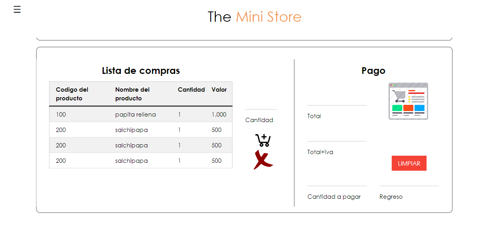

# The MiniStore Online
Aplicativo desarrollado en PHP, HTML y CSS, para el control de inventario en pequeños negocios.
 
 
 
 
 

Módulo de ingreso de usuario para iniciar sesión en el aplicativo.
 
 
 

Módulo de creación de cuenta para el registro de usuarios.
 
 
 

Módulo de compras para el cálculo y la realización de una factura.
 
 
 

Módulo para la administración de usuarios presentes en el sistema.
 
 
 

Módulo para la administración de productos presentes en el inventario.
 
 
 

Módulo para la administración de los proveedores de una tienda.
